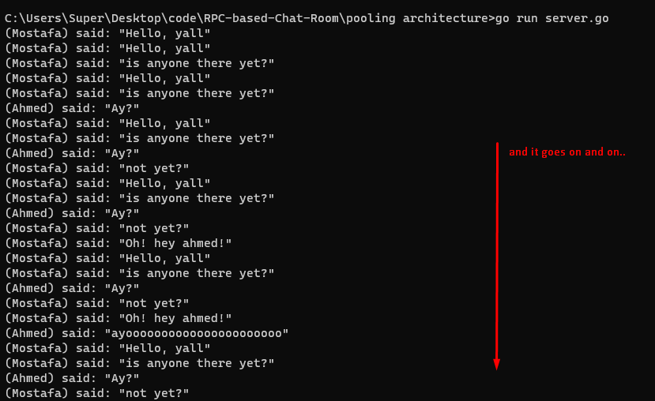
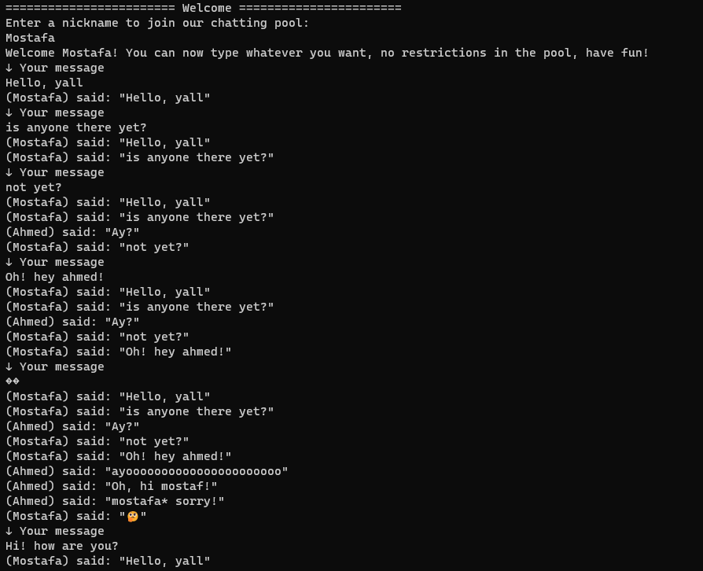
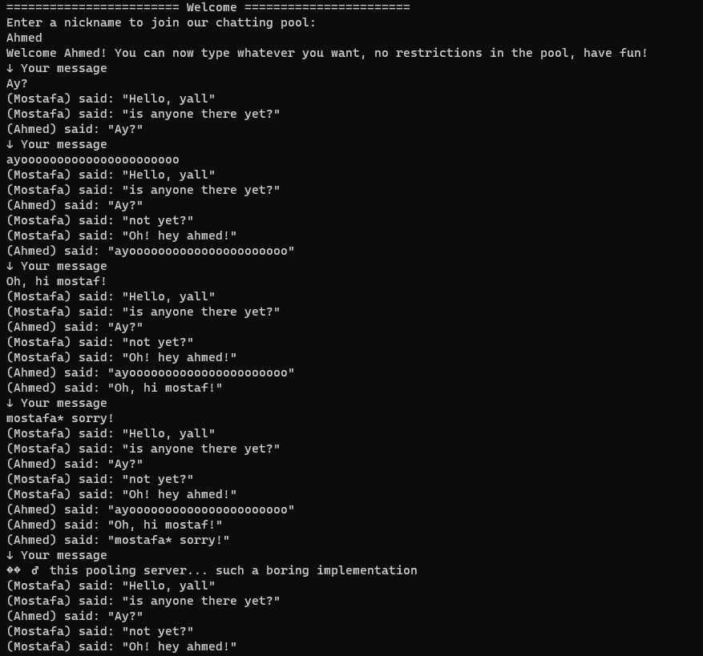
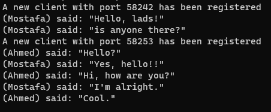
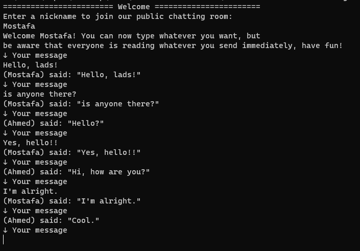
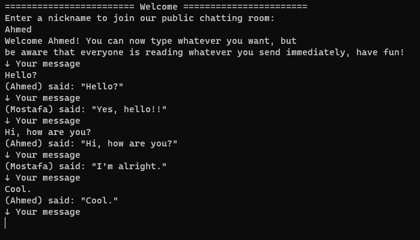

# RPC-based Chat Room
 RPC-based chat room service using Go, implemented using two different methods.


<br>

|                           | **Server** | **Client 1** | **Client 2** |
|---------------------------|--------|---------|---------|
| **Pooling Architecture**    ||||
| **Event-driven Architecture**      ||||


<br>

## Here
### You can see that I have used two different achitectures to implement a chat room, one that goes very stingy `(Pooling Architecture)`, logging the whole chat everytime a user types right to his face. The other one plays nice and is just working like the normal ones we see live `(Event-driven Architecture)`.

<br>

<br>

## 😎 **Quick start**

<br>

First, [download](https://go.dev/dl/) and install **Go**.

Next, make sure you are in the directory of one of the two methods, `pooling architecture` or `event-driven architecture`.

## Then just run the following, for both methods:

<br>

```bash
go run server.go
```
### and in other tabs (instances of your terminal or something)

<br>

`for the first client`

```bash
go run client.go
```

`for the second client`

```bash
go run client.go
```
<br>

## That's all you need to know to start chatting! ✅

<br>


---

<br>

##  ⚒️ **Built with**

<br>


- [Go](https://go.dev/) - Go is an open source programming language supported by Google. Used to build fast, reliable, and efficient software at scale.

<br>


## 🚩 [License](https://github.com/mostafa-aboelnaga/RPC-based-Chat-Room/blob/main/LICENSE)

MIT © [Mostafa Aboelnaga](https://github.com/mostafa-aboelnaga/)


